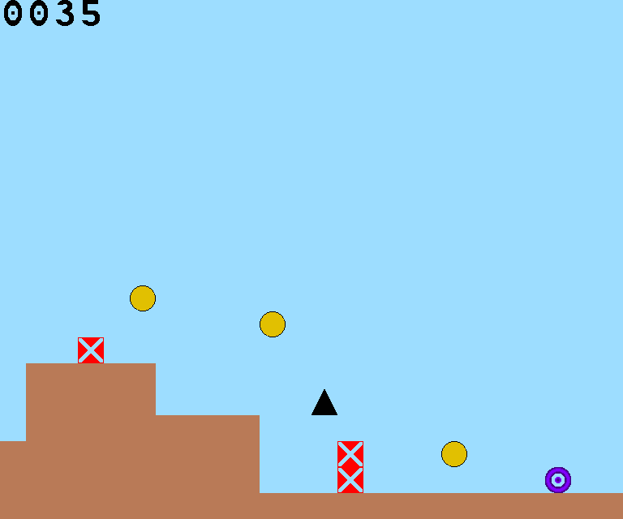

# The Game - a Python Machine Learning Environment

This project is the result of a Master's thesis that aimed at creating a primitive platformer python game which could serve as a machine learning environment. The basic instructions on how to run the game and repeat the experiments described in the thesis (or conduct new ones) is provided here - for a detailed description of the experiments and more info on the game, check the thesis. The learning algorithm is a modification of [aleju](https://github.com/aleju)'s [implementation](https://github.com/aleju/mario-ai) of the Deep Reinforcement Learning algorithm from the [Atari paper](https://arxiv.org/abs/1312.5602).

## General Requirements
The game needs Python 3.5 and the PyGame library (version 1.9.3 was used) to be run. For the AI, follow the installation procedure on <https://github.com/aleju/mario-ai>. You can skip the whole part with the emulator though, that is only needed if you want to run Super Mario. 

## The Game

### How to run the game
All files needed to run the game are inside the "Game Files" folder. If you want to run the game in "manual mode" (this can be set via the MODE variable at the beginning of game.py), you only need the gfx folder, paths.txt, game.py, utils.py, and worldSaver.py. And some levels.

Fit the paths.txt file to your needs. It contains the following parameters (in that order):
 * Folder where the levels are stored.
 * Naming pattern of all levels to use. Wildcards can be used, see python's fnmatch module. A level will be chosen randomly from all levels matching the pattern. 
 * Where to store the statistics file (and how to name it). This file will be created/appended. 
 * Folder where the screenshots are stored.

Then simply run game.py.

## The World Generator

### How to use it
The worldGenerator.py program can be used to generate world files for the game. The parameters for world generation are set in the _resetVariables()_ method. Use the _generateManyWorlds_ method to create the worlds (adapt the last line of the file). It takes the following arguments:
 * Number of worlds to be created.
 * Naming pattern for the created worlds. Should contain a "{}" somewhere, which will be replaced by an ascending number during generation of multiple worlds.
 * Whether each world should be printed to the console after creation.
 * Whether the _randomizeParams()_ method should be invoked before every world creation. Adapt the method to your needs if you want to create worlds with partly randomized parameters.
 * Whether the graphic tiles should be randomized for each world. This needs a folder in the working directory with the same structure as the gfx folder.

## Plot Statistics

### Additional Requirements
The matplotlib library.

### How to use it
plotStatistics.py is a small tool to plot the statistics generated by the game. It requires the matplotlib library for Python and can be run with command line arguments.
 - no command line arguments: The program will search for "losses.txt" and "statistics.csv" in the folder "learned" located at the current working directory. The losses file is optional, the plot for loss will be empty if it is missing. The structure that these files are expected to have is explained below.
 - one command line argument: The program assumes this argument to be a relative path to a directory and will search for "losses.txt" and "statistics.csv" in this directory. Otherwise behaves the same as for no arguments.
 - multiple command line arguments: All arguments are assumed to be relative paths to directories. Both aforementioned files will be searched in each of these directories and data with the same key from all files will be plotted into the same graph. When run in this mode, the tool will only plot the averages and no data that contains nested lists (like move count). 

In order for the tool to be able to plot the files, they need to have a specific structure. The losses file is expected to just contain numbers, one per line. Each number will be one data point in the plot. The statistics file is basically a table. One row per line, columns are separated by ";". The first line of the file contains the headers - these are used as keys, so duplicate names are not allowed. Unless indicated by a special header, columns are expected to contain only numbers (also no spaces). There are two special headers:
 - headers beginning with an "!" indicate columns containing miscellaneous data that will be ignored. ATTENTION: the tool can't handle columns without "!" that come after columns with "!", so if you have multiple columns with "!", move them to the end. 
 - headers containing "," indicate nested lists. The header then needs to have the format "name (subname1, subname2, ...)". The corresponding column is expected to contain not numbers, but serialized Python lists of numbers (which look like "\[value, value, ...\]"). The number of elements in each list of one column has to be the same as the number of subnames specified in its header. This column will be plotted into one graph, titled with the name from the header and containing one curve per subname. This is for example used for the move count. 

The tool normalizes the data before plotting. Unless changed in the source code, it expects a column named "frames since last update" and normalizes to a value of 1000. This means that lines are added up until the value in the specified column reaches or exceeds the specified value. Nested lists are accumulated correctly, non-number columns with "!" are ignored. This works fine for this project, as a new world is loaded every 1000 frames additionally to the the new world when the AI has beaten a level, so the lines should always add up to exactly 1000, leading to equally spaced data points in the plots. After normalizing this way, every line results in one data point. For all columns not containing nested lists, additionally an iteratively computed average will be plotted.
ATTENTION: Some of the experiments were conducted using an older version of the game that logged "deaths per frame", "coins per frame", and "levels beaten per frame". While the values for these columns are correct in the statistics files, they are wrongly accumulated by this tool. So when evaluating the given experiments, don't use graphs for any value that contains "per frame" in its name. 

The statistics file logged by the game matches the format required by this plotting tool. 

## The Experiments

### Folder Structure
The experiment folders in "Experiment Files" contain a "learned" and a "test" folder. The "learned" folder contains the data created while training: a loss file and the statistics file. The trained network and the replay memory are not included due to their size. The "test" folder contains the statistics files from testing. The names of the files contain the information which test set they belong to. The "random" and the "classic\_dummy" agents have not been tested and their folders don't contain a "test" folder. The "random" agent chooses a random action every time while the "classic\_dummy" agent is a basic classic agent that gets a dummy call to the AI after reaching the goal (see thesis or below). 

### How to do the Experiments
To repeat an experiment conducted in the thesis, follow these steps:
 - Copy all files from the "Game Files" folder into a new folder (called "working folder").
 - Search the "Experiment Files" folder for the experiment you want to repeat. Copy all files and directories from that folder except for the "learned" and "test" folders and replace the files in your working folder with them. 
 - If necessary, adapt "paths.txt". If running multiple instances at the same time, make sure they use different screenshot folders.
 - Run "game.py".

## Known Problems
### Dummy Call
As mentioned in the thesis, the AI never gets an input image showing the player on the goal, as there is no action for the AI to choose before the next level is loaded. To test whether this has a negative influence on the learning behavior, two AI variants were trained using a "dummy call": when the player hits the goal, the AI is called (and thus gets an image of the player standing on the goal) and chooses an action which is discarded. Only one of these tests is included in this repo (classic\_dummy), but both show a strong increase in beaten levels when compared to the version without dummy call. The code for the dummy call is contained in a comment block in game.py, nearly at the end of the file (about line 530). Just remove the apostrophes to include the dummy call. This is advised, as it is likely to create better AIs. 
